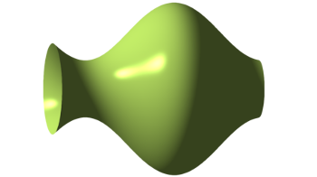
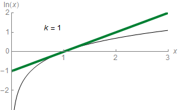

Welcome to the homepage of **Math F252 Calculus II** (section 001), Spring 2022, in the [Dept. of Mathematics and Statistics](http://www.uaf.edu/dms/) at the [University of Alaska Fairbanks](http://www.uaf.edu/).

Instructor:  [Ed Bueler](http://bueler.github.io/) ([elbueler@alaska.edu](mailto:elbueler@alaska.edu)) &nbsp; &nbsp;  I hold [office hours](http://bueler.github.io/OffHrs.htm) in Chapman 306C.

### Getting Started

* Read the [Syllabus](syllabus.pdf).

* See the [Schedule](schedule.pdf).  Check it often to find out what happens next!

* The textbook is online: [OpenStax Calculus Volume 2](https://openstax.org/details/books/calculus-volume-2).

* The [Canvas course page](https://canvas.alaska.edu/courses/7049) is important!  Go there for your grades, solutions to [Homework](homework.html), [Quizzes](quizzes.html), and [Exams](exams.html), and a link to Gradescope for submitting [Homework](homework.html).

* For the [Homework](homework.html), the solutions are available in advance.  (Find them at the [Canvas page](https://canvas.alaska.edu/courses/7049).)  Your Homework will be graded for completion and effort.  You will need to scan and upload each [Homework](homework.html) set as a single PDF file in Gradescope, accessed from the [Canvas page](https://canvas.alaska.edu/courses/7049).  See the [Tech Help](techHelp.html) page for help on scanning and uploading.

### Resources

* The [Math & Stat Tutoring Lab](https://www.uaf.edu/dms/mathlab/index.php) is **open** for in-person tutoring and online tutoring!  You can [sign up for online tutoring](https://fairbanks.go-redrock.com/).

* The [Videos](videos.html) tab might help.  It is a week-by-week, curated list of possibly-useful videos from the web.

* The [Quizzes](quizzes.html) and [Exams](exams.html) pages include old versions with solutions.  (However, they are not perfectly aligned with our course.)

### Links

* Want to know what we will be studying?  See these Wikipedia pages:
   * [integrals](https://en.wikipedia.org/wiki/Integral)
   * [solids](https://en.wikipedia.org/wiki/Solid_of_revolution) and [surfaces of revolution](https://en.wikipedia.org/wiki/Surface_of_revolution)
   * [differential equations](https://en.wikipedia.org/wiki/Ordinary_differential_equation)
   * [sequences](https://en.wikipedia.org/wiki/Sequence)
   * [series](https://en.wikipedia.org/wiki/Series_(mathematics))
   * [Taylor series](https://en.wikipedia.org/wiki/Taylor_series)
   * [parametric equations](https://en.wikipedia.org/wiki/Parametric_equation)
   * [polar coordinates](https://en.wikipedia.org/wiki/Polar_coordinate_system)

 &nbsp; &nbsp; 

---
_Site design derived from [coordinated Calc I](https://uaf-math251.github.io/), an original [Jekyll](https://jekyllrb.com/) design by [David Maxwell](https://damaxwell.github.io/)._

