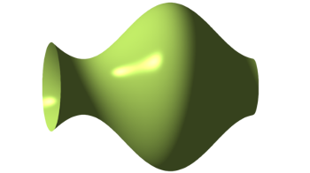
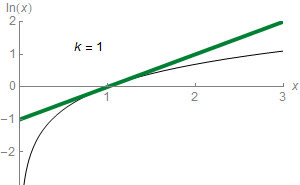

Welcome to the homepage of **Math F252 Calculus II** for **Spring 2026** in the [Dept. of Mathematics and Statistics](http://www.uaf.edu/dms/) at the [University of Alaska Fairbanks](http://www.uaf.edu/).

### Instructors

  * Glen Woodworth, asynchronous section 001 (CRN 30347)
    * info: asynchronous online on [Canvas](https://canvas.alaska.edu/courses/30029)
    * contact: [gwoodworth@alaska.edu](mailto:gwoodworth@alaska.edu)
  * [Youngho Yoo](https://sites.google.com/view/younghoyoo/), in-person section 901 (CRN 31037)
    * info: MWF 11:45am-12:45pm, Th 11:30am-1pm, Gruening 409
    * contact: Chapman 303B, [yyoo2@alaska.edu](mailto:yyoo2@alaska.edu)
  * [Ed Bueler](https://bueler.github.io/), in-person section 902 (CRN 31788)
    * info: MWF 9:15-10:15am, Th 9:45-11:15am, Chapman 106 
    * contact: Chapman 306C, [elbueler@alaska.edu](mailto:elbueler@alaska.edu)

### Canvas course pages

Log in to the Canvas page for your section:

  * Woodworth (asychronous section 001): [canvas.alaska.edu/courses/30029](https://canvas.alaska.edu/courses/30029)
  * Yoo (in-person section 901): [canvas.alaska.edu/courses/30032](https://canvas.alaska.edu/courses/30032)
  * Bueler (in-person section 902): [canvas.alaska.edu/courses/30035](https://canvas.alaska.edu/courses/30035)

to see

  * your grades
  * the link to Gradescope for submitting Homework
  * solutions to Homework
  * other Announcements

### Getting Started

* Read the Syllabus for your section (tab at left).  "In-person" is for sections 901 and 902 (Yoo & Bueler).

* See the Schedule for your section (tab at left).  Check it often to find out what happens next!

* The textbook is online: [OpenStax Calculus Volume 2](https://openstax.org/details/books/calculus-volume-2).

* Do the [Homework](homework.html).

  * **Homework solutions are available in advance at the Canvas page!**  Really!  Your Homework will be graded only for completion and effort, but of course you need to write something sensible.  You will need to scan and upload each [Homework Assignment](homework.html) as a single PDF file in Gradescope; find the Gradescope link on your section's Canvas page (as above).  See the [Tech Help](techHelp.html) page for help on scanning and uploading.

* Show up and take the weekly [Quizzes](quizzes.html).

* There are [two Midterms and a Final](exams.html).  See the Schedule for your section (tab at left) for dates.  See the [Exams](exams.html) tab for the sections covered and old exams for review.

### Resources

* The [Math & Stat Tutoring Lab](https://www.uaf.edu/dms/mathlab/index.php) is **open** for in-person tutoring and online tutoring!  You can sign up for online tutoring.

* The [Quizzes](quizzes.html) and [Exams](exams.html) tabs include old versions with solutions.

* Find [calculus video playlists at the Videos tab](videos.html).

* What are we studying?  Check out these Wikipedia pages:
   * [integrals](https://en.wikipedia.org/wiki/Integral)
   * [solids](https://en.wikipedia.org/wiki/Solid_of_revolution) and [surfaces of revolution](https://en.wikipedia.org/wiki/Surface_of_revolution)
   * [integration by parts](https://en.wikipedia.org/wiki/Integration_by_parts)
   * integration by [trigonometric substitution](https://en.wikipedia.org/wiki/Trigonometric_substitution)
   * integration by [partial fractions](https://en.wikipedia.org/wiki/Partial_fraction_decomposition)
   * [differential equations](https://en.wikipedia.org/wiki/Ordinary_differential_equation)
   * [sequences](https://en.wikipedia.org/wiki/Sequence)
   * [series](https://en.wikipedia.org/wiki/Series_(mathematics))
   * [Taylor series](https://en.wikipedia.org/wiki/Taylor_series)
   * [parametric equations](https://en.wikipedia.org/wiki/Parametric_equation)
   * [polar coordinates](https://en.wikipedia.org/wiki/Polar_coordinate_system)

 &nbsp; &nbsp; 

---
_Site design derived from the [coordinated Calc I website](https://uaf-math.github.io/calc1/), an original [Jekyll](https://jekyllrb.com/) design by [David Maxwell](https://damaxwell.github.io/)._

